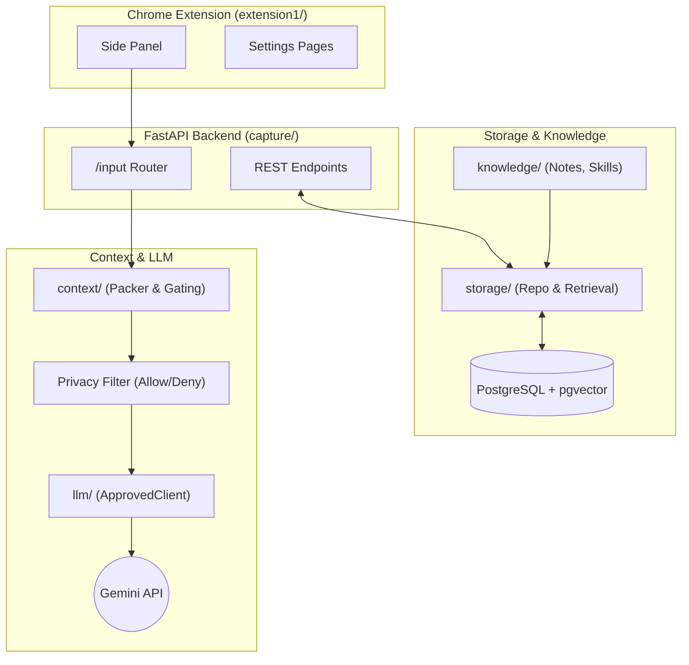

# Aside

A quiet personal assistant that lives in the background ("margin + Alfred"). Always there, never in the way, usable or ignorable. Aside consists of a Python backend (FastAPI, Postgres + pgvector) and a Chrome side-panel extension. 

It captures tasks, schedule entries, notes and chat through one endpoint, records app/browser activity into sessions, writes a nightly review, and compiles highly structured context for an LLM (Gemini).

Crucially, **every model call goes through one gated client**: a daily call cap, a privacy filter on what may leave the machine, and a trace of every attempt.

## Architecture

Aside is built around a strict pipeline that separates data collection, context compilation, LLM interaction, and UI rendering.

### Key Components

- **`capture/`**: The FastAPI server. Handles routing (`/input`), direct model calls for chat and schedule drafts, scheduling generation endpoints, and background collector processes (desktop activity).
- **`context/`**: The context framework. Consists of Sources, Items, Recipes, and a Packer. Prioritizes context within an absolute token ceiling. Includes the **Privacy Layer** which explicitly denies flagged items (e.g., `journal` tags) from ever reaching an LLM prompt.
- **`llm/`**: The model-agnostic LLM interface. Features a strict `ApprovedClient` that enforces daily quotas, handles timeouts/retries, and traces all usage. Nothing can reach a model except through it.
- **`storage/` & `knowledge/`**: Handles interactions with Postgres, including pgvector for semantic note search.
- **`schedule_gen/`**: Pipeline for generating tomorrow's schedule using context and constraints.
- **`extension1/`**: The frontend. A Material-3 dark UI living in a Chrome side panel.

## Core Principles

1. **Never get in the way.** No notifications, no badges, no auto-writes to the schedule. Everything is visible in settings, undoable, and quiet.
2. **Strict Quota & Cost Control.** LLM background tasks are strictly regulated. The system operates on a free-tier discipline, tracking local usage against the provider's daily cap.
3. **Data Quality First.** The real value is in the structured history of the user's day (planned vs. actual, focus hours, slipped tasks) which feeds long-term pattern recognition.

